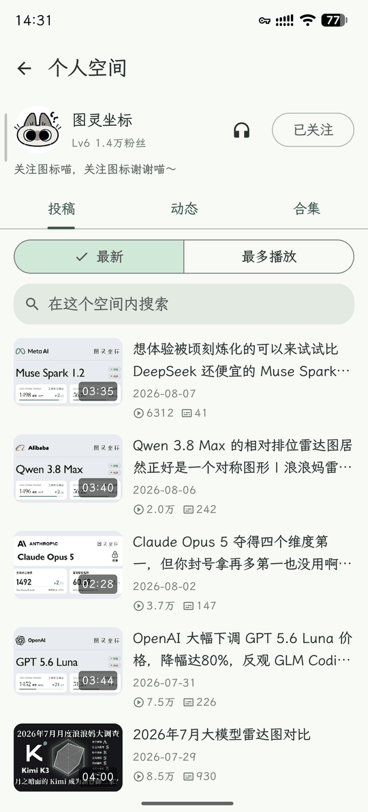
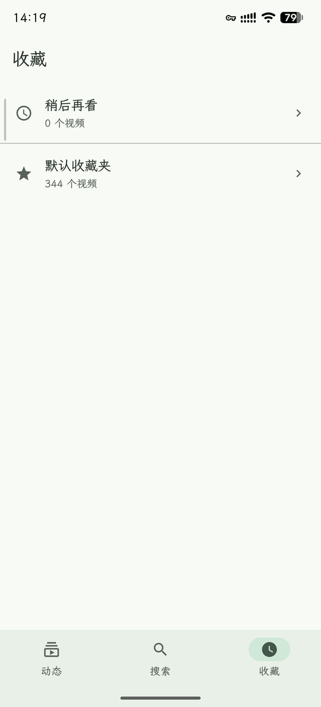
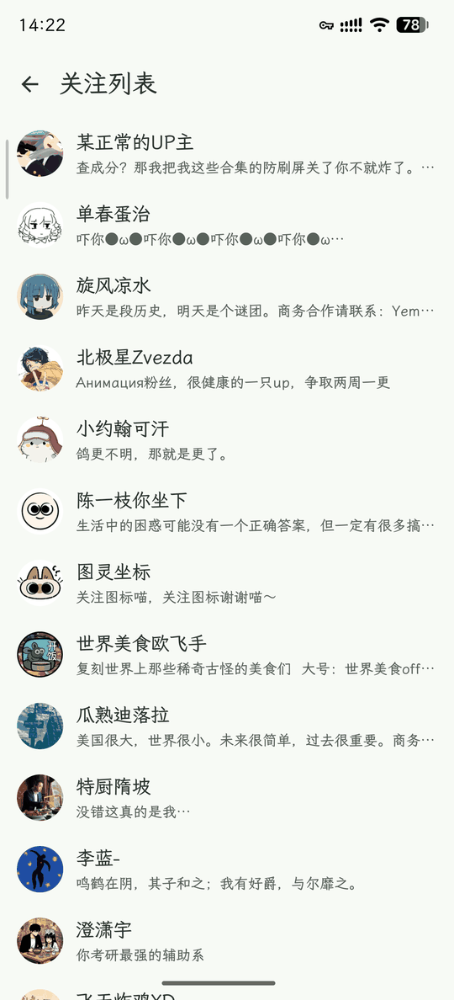

# Bilby

### No recommendations. Only what you choose.

[简体中文](README.md)

Bilby is an Android client for bilibili. The home screen carries updates from the uploaders
you follow, newest first, and scrolling down only takes you further back in time. There is
no recommendation feed, no related-videos rail, and no autoplay.

> **This project is under active development.** The interface and the API layer are both
> still changing, and neither stability nor compatibility is guaranteed.

<table>
<tr>
<td></td>
<td></td>
<td></td>
</tr>
<tr>
<td align="center">Feed and most-visited</td>
<td align="center">Player, parts and collection</td>
<td align="center">Listening mode</td>
</tr>
<tr>
<td></td>
<td></td>
<td></td>
</tr>
<tr>
<td align="center">Assistant searching</td>
<td align="center">Assistant answer</td>
<td align="center">Uploader page</td>
</tr>
<tr>
<td></td>
<td></td>
<td></td>
</tr>
<tr>
<td align="center">Watch later and favourites</td>
<td align="center">Inside a folder</td>
<td align="center">Following list</td>
</tr>
</table>

On the video page, the slot the official app fills with recommendations holds this video's
collection and the uploader's other work instead: a set fixed the moment you opened the
video, played to the end and then stopped.

Finding anything else takes asking. Search works the usual way, or hand it to the assistant,
which searches, reads descriptions and top comments, and comes back with a few videos and
its reasons for each.

## Features

Done:

- [x] Following feed, search, watch-later, uploader pages
- [x] Most-visited uploaders and the full following list
- [x] Playback: fullscreen, quality, speed, long-press fast-forward, drag-to-seek, lock, double-tap pause, multi-part videos
- [x] Listening mode: same player as watching, background playback, notification, lock screen and headset controls, sleep timer
- [x] Comments: read, sort, expand reply threads, post, like, delete
- [x] Likes, coins, favourites, following
- [x] SponsorBlock segments skipped by default
- [x] Assistant search: searches, reads descriptions and top comments, returns videos with reasons

Planned:

- [ ] Danmaku
- [ ] CI regression tests
- [ ] Interface and motion polish
- [ ] Search refinements
- [ ] Player refinements
- [ ] Agent harness work
- [ ] Live streams
- [ ] Picture-in-picture
- [ ] Columns (articles)
- [ ] Opening and sharing bilibili links
- [ ] Filtering low-quality comments

## Install and sign in

```
./gradlew installDebug
```

Sign in by scanning the qrcode with the bilibili app. One account, once.

The assistant needs an OpenAI-compatible endpoint. Fill in the address and key under
Assistant in settings.

Requires Android 10 or later.

## Contributing

Bug fixes, crash reports, documentation and small corrections can go straight to a pull
request.

For features and breaking changes, please open an RFC issue first, describing what you want,
what the app does about it today, and what the design would look like. It exists so you do
not write code in a direction the project cannot take: the behaviour described above is
fixed, a pull request that moves it is unlikely to land, and finding that out afterwards
costs you the work.

LLM-assisted code is fine, on two conditions: you understand what the code you submit does,
enough to say why it works and what it touches; and you have run it on a real device before
submitting.

`CLAUDE.md` carries the working conventions worth knowing before a first change.

## License

GPL-3.0-or-later, see [LICENSE](LICENSE). The implementation of everything that talks to
bilibili — WBI signing, AppSign, the device fingerprint, TV qrcode login, playurl parameters,
reporting and write actions — is ported from
[PiliPlus](https://github.com/bggRGjQaUbCoE/PiliPlus) (GPL-3.0).
