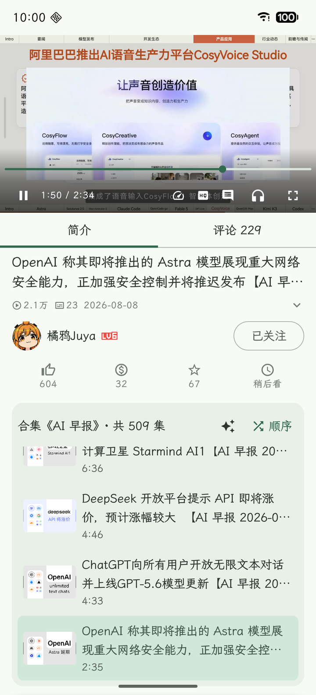
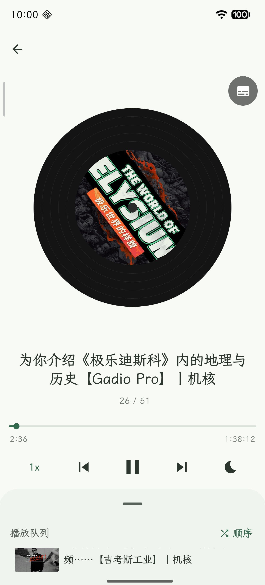

<p align="center"></p>

# Bilby

### No recommendations. Only what you choose.

[](README.md) &ensp; [](https://github.com/NihilDigit/bilby/releases/latest) &ensp; [](https://github.com/NihilDigit/bilby/attestations) &ensp; [](https://deepwiki.com/NihilDigit/bilby)

Bilby is a native Android client for bilibili, with a feed you control: it carries the
uploaders you follow and the searches you start. **There is no recommender in the app**,
and nothing you did not choose is inserted into your lists.

> **This project is under active development.** The interface and the API layer are both
> still changing, and neither stability nor compatibility is guaranteed.

## A redesigned experience

<table align="center">
<tr>
<td></td>
<td></td>
<td></td>
</tr>
<tr>
<td align="center">The home screen is organised by who you follow</td>
<td align="center">The queue comes from the collection or the uploader</td>
<td align="center">Listening: its own interface, seamless from playback</td>
</tr>
</table>

## Searching is something you start

<table align="center">
<tr>
<td></td>
<td></td>
<td></td>
</tr>
<tr>
<td align="center">The search itself is visible</td>
<td align="center">Candidates, each with its reason</td>
<td align="center">Can be started from the video page</td>
</tr>
</table>

## Features

Done:

- [x] Following feed, search, watch-later, uploader pages
- [x] Most-visited uploaders and the full following list
- [x] Playback: fullscreen, quality, speed, long-press fast-forward, drag-to-seek, lock, double-tap pause, multi-part videos; listening continues in the background, normal playback pauses
- [x] Listening mode: same player as normal playback, background playback, notification, lock screen and headset controls, sleep timer
- [x] Danmaku display: scrolling, top and bottom, following the playback clock, adjustable opacity
- [x] AI subtitles: under the picture during normal playback, as a transcript while listening
- [x] Comments: read, sort, expand reply threads, post, like, delete, tap a timestamp to seek
- [x] Likes, coins, favourites, following; joint submissions credit each uploader separately
- [x] SponsorBlock segments skipped by default
- [x] Assistant search: searches, reads descriptions and top comments, returns videos with reasons; can also be started from the video page

Planned:

- [ ] Sending danmaku
- [ ] AI subtitle fixes
- [ ] Rich text rendering in assistant replies
- [ ] CI regression tests
- [ ] Interface and motion polish
- [ ] Edge-to-edge and status bar handling
- [ ] Search refinements
- [ ] Agent harness work
- [ ] Live streams
- [ ] Picture-in-picture
- [ ] Columns (articles)
- [ ] Opening and sharing bilibili links
- [ ] Filtering low-quality comments

## Install and sign in

Download an APK from [Releases](https://github.com/NihilDigit/bilby/releases/latest).
`universal` runs on any device; the per-architecture builds are smaller, and current
devices are typically `arm64-v8a`.

Provenance is checkable: `gh attestation verify <file> --repo NihilDigit/bilby`.

Or build it:

```
./gradlew installDebug
```

Sign in by scanning the qrcode with the bilibili app. One account, once.

The assistant needs an OpenAI-compatible endpoint. Fill in the address and key under
Assistant in settings.

Requires Android 10 or later.

## Contributing

Bug fixes, crash reports, documentation and small corrections can go straight to a pull
request.

For features and breaking changes, please open an RFC issue first, describing what you want,
what the app does about it today, and what the design would look like. It exists so you do
not write code in a direction the project cannot take. No recommendations, a queue fixed at
the moment a video is opened, and an assistant that keeps nothing between requests are all
settled; a pull request that moves them is unlikely to land, and finding that out afterwards
costs you the work.

LLM-assisted code is fine, on two conditions: you understand what the code you submit does,
enough to say why it works and what it touches; and you have run it on a real device before
submitting.

`CLAUDE.md` carries the working conventions worth knowing before a first change.

## License

GPL-3.0-or-later, see [LICENSE](LICENSE). The implementation of everything that talks to
bilibili — WBI signing, AppSign, the device fingerprint, TV qrcode login, playurl parameters,
reporting and write actions — is ported from
[PiliPlus](https://github.com/bggRGjQaUbCoE/PiliPlus) (GPL-3.0).
